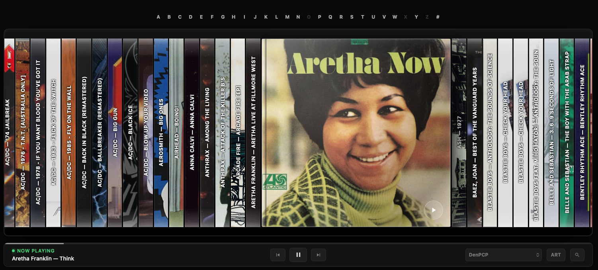

# CD Shelf for Lyrion Music Server

A jewel-case style album browser for Lyrion Music Server, with Material Skin integration, player selection and a full-width shelf layout.

## Attribution

CD Shelf is based on the **“CD Shelf – a custom 3D CD spine browser”** shared by Reddit user **ChrisHoppyBot** in r/squeezebox. Original concept and code by ChrisHoppyBot. LMS plugin packaging, Material integration, player selection and subsequent UI modifications by Joe Leech.

Original Reddit post:
https://www.reddit.com/r/squeezebox/comments/1v733oc/share_cd_shelf_a_custom_3d_cd_spine_browser/

## Lyrion repository

Add this URL under **Settings -> Plugins -> Additional Repositories**:

`https://raw.githubusercontent.com/mrj0e/cdshelf/main/repo.xml`

## Release files

- `releases/CDShelf-0.7.1.zip` - installable plugin archive
- `releases/CDShelf-0.7.1.sha1` - SHA1 checksum
- `repo.xml` - LMS repository manifest

The SHA1 in `repo.xml` matches the included ZIP. If the ZIP changes, regenerate its SHA1 and update `repo.xml`.
